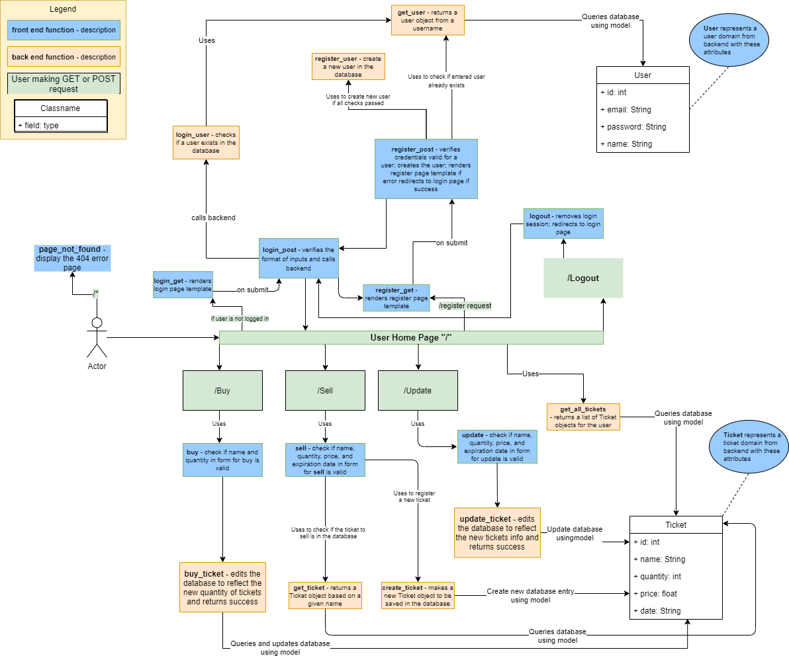

# Design Specification

The following is a diagram showing the program flow from user requesting routes to the front-end and backend functions called as a result.
The diagram gives descriptions of the functions used and their connection to one another and back to how the user interacts with the application.

# Front-end Functions:
All post methods (*_post) will return the /login page if the user has not logged in

Function: login_get
Input: None
Output: login page template rendered with message “Please Login”

Function: login_post 
Input: email and password
Output: if the user exists return homepage otherwise login page template with error message

Function: register_get
Input: None
Output: register page template

Function: register_post
Input: email name, password and password2
Output: if success login page, else if error with login format return login page with error, otherwise return register page with error

Function: logout
Input: None
Output: homepage

Function: profile
Input: user taken from session
Output: If the user has not logged in return login page else home page (index page)

Function: sell
Input: name, quantity, price, date
Output: homepage possibly with error message

Function: buy
Input: name, quantity
Output: homepage possibly with error message

Function: update_post
Input: name, quantity, price, date
Output: homepage possibly with error message

Function: page_not_found
Input: None
Output: 404 error page 

# Back-end Functions

Function: get_user
Input: email
Output: User object or None on failure

Function: login_user
Input: email and password
Output: User object or None on invalid password for email provided

Function: register_user
Input: email, name of user, password, and another password input
Output: Success status

Function: get_all_tickets
Input: None
Output: all tickets in the database as a list of Ticket objects

Function: create_ticket
Input: name, quantity, price, date, and email (of user)
Output: Success states of ticket creation

Function: get_ticket
Input: name
Output: ticket object of the name

Function: buy_ticket
Input: name, quantity, user
Output: Success state

Function: update_ticket
Input: name, quantity, price, date
Output: Success state
